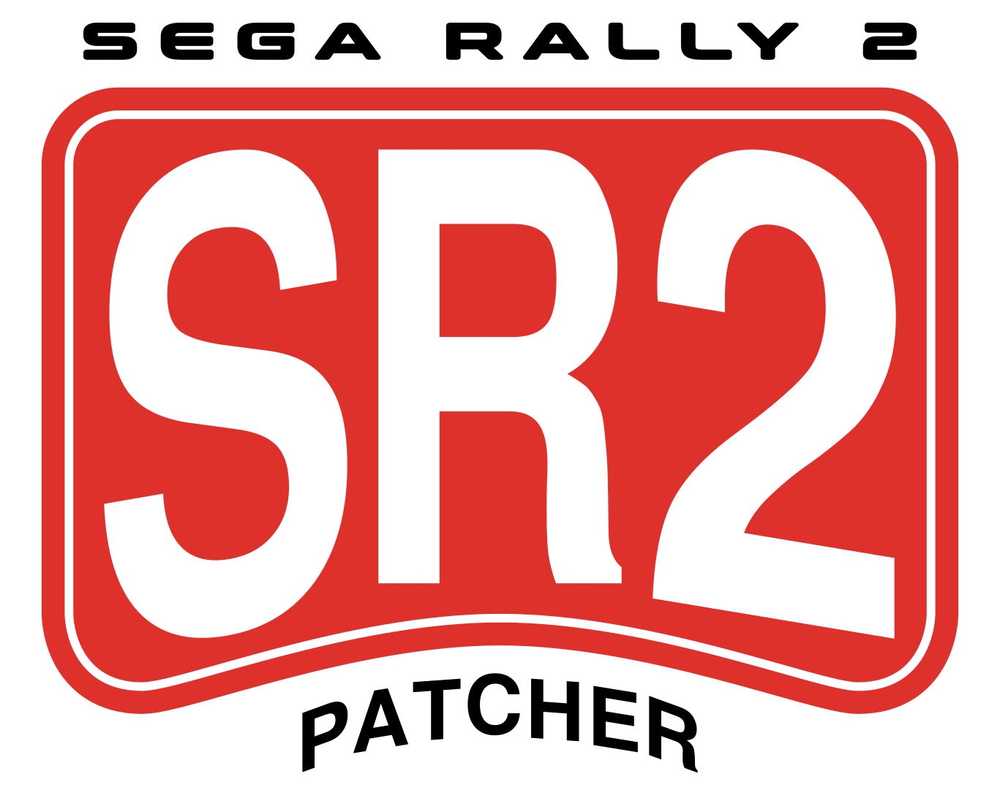

<p align="center">
  
</p>

# SR2 Patcher

Gets *SEGA RALLY 2* (PC, 1999) running properly on a modern system.
Install it from your disc images, press a button, and it plays: no
crashes, no invisible text, no dead controller, no disc in the drive.

You also get the picture at your monitor's size and shape, the soundtrack
from files, an XInput pad you can rebind in-game, and online play with no
port forwarding. Windows 10 and 11, Wine and Proton.


**Work in progress.** The game plays start to finish on all three of
upstream's releases, and on the Japanese one this fork adds - races,
Mountain, and the ten-year championship to its tenth ending. This is a
hobby project poking at a 27-year-old binary and things will turn up.
[Reporting a bug](#reporting-a-bug) says what helps.

<h4 align="center">
  <a href="#quick-start">Quick start</a> &nbsp;·&nbsp;
  <a href="#virus-warnings">Virus warnings</a> &nbsp;·&nbsp;
  <a href="#disc-images">Disc images</a> &nbsp;·&nbsp;
  <a href="#what-the-patches-do">Patches</a> &nbsp;·&nbsp;
  <a href="#widescreen">Widescreen</a> &nbsp;·&nbsp;
  <a href="#controls">Controls</a>
  <br /><br />
  <a href="#internet-play">Internet play</a> &nbsp;·&nbsp;
  <a href="#music">Music</a> &nbsp;·&nbsp;
  <a href="#builds">Builds</a> &nbsp;·&nbsp;
  <a href="#the-japanese-releases">Japanese</a> &nbsp;·&nbsp;
  <a href="#from-a-terminal">Terminal</a> &nbsp;·&nbsp;
  <a href="#reporting-a-bug">Bugs</a> &nbsp;·&nbsp;
  <a href="#known-issues">Known issues</a>
</h4>

## Quick start

**Download** `sr2-patcher-*-win.zip` from the
[latest release](https://github.com/pairomaniac/sr2-patcher/releases/latest),
unzip it anywhere and run `sr2-patcher-*.exe`; the `_internal` folder
beside it has to stay. It is unsigned, so SmartScreen calls it an unknown
publisher the first time you run it. If a virus scanner objects, see
[Virus warnings](#virus-warnings).

On Linux, or on Windows if you would rather not run an exe, take
`-python.zip` from the same page and run the script:

1. **Install Python** from [python.org](https://www.python.org/downloads/),
   3.8 or newer. On the installer's first page, tick **Add python.exe to
   PATH**. Tk, which draws the window, comes with it. On Linux, see
   [From a terminal](#from-a-terminal).
2. **Unzip it** somewhere of its own. `MGNetWk.dll` has to stay in the
   `net` folder beside the script, or [Internet play](#internet-play) has
   nothing to install.
3. **Run it.** Double-click `sr2-patcher.py`, or open a terminal in its
   folder and run `py sr2-patcher.py`.

<p align="center">
  
</p>

The window is split into numbered sections. Work through them in order:

1. **GAME FOLDER** - where the game is, or an empty folder to put it in.
   Everything below works on this one folder. An install of your own has
   to be unmodified; if yours is refused, see [Builds](#builds).
2. **INSTALL** - put disc 1's `.cue` in **Install disc**, disc 2's in
   **Play disc**, then press **Install game** and **Rip soundtrack**.
   Skip this section if the game is already in the folder above. See
   [Disc images](#disc-images) and [Music](#music).
3. **ESSENTIAL PATCHES** - always applied, no tick boxes.
4. **EXTRA PATCHES** - all ticked, and yours to change. Click the ⓘ
   beside one to read what it does, then press **Apply patches**.
5. **ADD-ONS** - on Windows **dgVoodoo 2** is ticked and downloaded when
   you press Apply. See [Add-ons](#add-ons).

Then run `SEGA RALLY 2.exe` from that folder. **Restore original** puts
the game back if you change your mind.

## Virus warnings

Defender and other scanners sometimes flag the patcher. It is a false
positive: an unsigned program that edits another program is the sort of
thing they warn about. To allow it in Defender: Windows Security → Virus
& threat protection → Protection history → the entry for the file →
Allow, then run it again.

Every release is built on GitHub from this repository, and the build log
lists the exe's checksum if you want to check that yours matches. If you
would rather not run an exe at all, the `-python.zip` on the same page is
the script, which you can read.

The one binary the patcher installs is `MGNetWk.dll` for
[Internet play](#internet-play), compiled from the C in `net/`. It
travels as its own file rather than hidden inside the script, and the
patcher checks it against a known hash before writing it.

## Disc images

The patcher reads the images itself. Nothing to mount, no virtual drive,
and no disc in the drive afterwards.

You need both discs: the game is on the first, the music on the second.

- **Install disc** - a `.cue` with its `.bin` beside it, an `.iso`, a
  folder you have already copied the disc to, or its `data1.cab`. The
  `.cue` is the small text file, not the `.bin`.
- **Play disc** - a `.cue` with its `.bin` files. An `.iso` will not do
  here: it drops the audio tracks, and those are the music.

The game takes about 800 MB and the soundtrack another 550 MB.

### If you have the discs, not images

Image them once:

- **Windows** - [ImgBurn](https://www.imgburn.com) in *Read* mode, with
  the output set to **BIN/CUE** rather than ISO.
- **Linux** - `cdrdao`, then its own `toc2cue`:

  ```bash
  cdrdao read-cd --driver generic-mmc-raw --datafile sr2-disc2.bin \
      sr2-disc2.toc /dev/sr0
  toc2cue sr2-disc2.toc sr2-disc2.cue
  ```

## What the patches do

**Essential** patches fix what is broken on a modern machine and are
always applied. **Extra** patches are down to taste: each starts ticked,
and unticking it takes it back out on the next **Apply patches**.

What each one changes, down to the byte, is in
[docs/NOTES.md](docs/NOTES.md).

### Essential

- **No disc required** - every mode plays with nothing in the drive.
- **Skip the start-up checks** - a 1999 video card, a 640x480 16-bit
  display mode, a 16-bit desktop and, on the Australian release, Windows
  98. Nothing today passes them.
- **Crash fixes** - on start-up, on the logo screen, and on the way out
  of the replay gallery.
- **Fix the picture after ALT+TAB** - it comes back instead of staying
  black.
- **Fix the device scan** - the white window on start. The game read
  every USB device on the machine and modern keyboards and pads choked
  it.
- **Windowed and borderless** - **ALT+ENTER** switches. Stock it took the
  whole screen at 640x480.
- **Text and panel fixes** - the menu text, the name you type, the team
  list and the chat were all invisible, and the team room's panels came
  out black with dgVoodoo 2.
- **Fix the HUD over the scenery** - the tachometer no longer blanks the
  lake behind it on Mountain.
- **Sound fixes** - the three volume sliders now match each other.
- **No registry** - settings sit beside the game, so the folder can be
  copied anywhere.

### Extra

- **Native widescreen** - the game renders at your screen's size and
  shape instead of 640x480 stretched. See [Widescreen](#widescreen).
- **Music from files** - the soundtrack plays from the folder instead of
  the disc. See [Music](#music).
- **XInput gamepad support** - a modern pad works everywhere, and every
  control is rebindable in-game. See [Controls](#controls).
- **Internet play** - race anyone, no port forwarding. See
  [Internet play](#internet-play).
- **Loading screens** - the stage card is held for three seconds. Today's
  machines load faster than you can read it.

### Add-ons

An add-on is an extra file beside the game rather than an edit to it.
Tick it and press **Apply patches**; it is downloaded at that point, so a
scanner may have something to say - see
[Virus warnings](#virus-warnings).

**dgVoodoo 2** is [dege's](https://github.com/dege-diosg/dgVoodoo2)
DirectDraw on Direct3D 11. Windows' own DirectDraw refuses a picture over
2048 a side and has grown slow and erratic with this game on some
machines; this has neither problem. It is ticked by default on Windows
and off under Wine and Proton, which have no such limit. Untick it and
Apply to take it out again, your settings kept; **Restore original**
takes those as well.

### Diagnostics

The collapsed **DIAGNOSTICS** section adds logging for a bug report.
Everything in it is off unless you ask for it, and none of it changes how
the game plays. What each one writes is in
[docs/DEVELOPING.md](docs/DEVELOPING.md).

## Widescreen


<p align="center">
  
  
</p>

**Options → Graphic Settings** gains an **Aspect Ratio** row - 4:3,
16:10, 16:9, 21:9, 32:9 - and a **Resolution** row listing that shape's
sizes, up to 3840x2160 and 5120x1440. The picture changes at the next
screen.

A wide screen shows more at the sides rather than stretching the middle.
The menus and the HUD keep their shape in the centre; the title and mode
select stay 4:3, with the picture blurred behind them to fill the sides.

Two-player split screen follows the same size:


On Windows the list stops at 2048 a side without the dgVoodoo 2 add-on -
see [Known issues](#known-issues).

## Controls

An XInput pad works as it is: stick to steer, triggers for the pedals,
Start to pause. In the menus the D-pad or stick moves, A and Start
choose, and B goes back; in the multiplayer team room Back switches
between the slot list and the MENU row, as TAB does.

**Options → Device Settings** is a new page showing both players'
controls, keyboard and pad side by side. Press a key or a button to
rebind any of them. The controls are saved as plain text in `SR2.CFG`
next to the game.

<p align="center">
  
  
</p>

## Internet play

<p align="center">
  
</p>

The connection screen offers three rows in place of IPX, TCP/IP, modem
and serial:

- **INTERNET** - **SHOW TEAMS** lists the teams open anywhere. Joining
  needs no port forwarding.
- **DIRECT IP** - type the host's address, or `host:port`. The host
  forwards UDP 47626.
- **LAN** - searches the local network.

The team room, the chat, the car and course selection and the race are
the game's own. Up to four players, and everyone needs the same patcher
version. If something goes wrong online, `sr2-net.log` from each machine
is the report to send - create the empty file beside the exe first. How
it works is in [docs/NETWORK.md](docs/NETWORK.md).

## Music

The soundtrack is thirteen audio tracks on the play disc, which is why a
stock install is silent without it in the drive. **Rip soundtrack**
copies them into a `music` folder beside the game, about 550 MB, and the
**Music from files** patch plays them from there.

Or from a terminal:

```bash
python3 sr2-patcher.py --rip "Sega Rally 2 (Disc 2).cue" ~/games/sr2
```

Any pressing's disc 2 will do: stripped of digital silence the three are
the same recording.

## Builds

The patcher knows the European, American and Australian releases, tells
them apart by itself, and installs and patches the Pentium III build of
each - the one the original installer chose on any CPU of the last
twenty-five years. This fork adds a fourth, MediaKite's Japanese
rerelease, which is not upstream's; see
[The Japanese releases](#the-japanese-releases).

| Release | `SEGA RALLY 2.exe` | MD5 |
| --- | --- | --- |
| European | 1,469,952 | `51b3da97c3c73611d3516b65bb684cb5` |
| American | 1,472,000 | `90d1f25110781707a888475ca37e9240` |
| Australian | 1,754,624 | `84c95aed1b8cd8402fcff98f1687df7b` |
| Japanese (MediaKite) | 1,469,952 | `5c0242443ea289d3d461b15eddb63388` |

Japan's three other pressings are not known: no dump of one has been
seen, and one would be welcome.

Before it writes anything the patcher checks every file it knows by
size and checksum. If one does not match, nothing is touched and you get
a line naming it - usually a modified game or a half-patched install, and
the fix is to install afresh from the disc.

Each patched file gets a `.bak` beside it. Apply starts from those every
time, so patching twice is the same as patching once, and **Restore
original** puts them back.

## The Japanese releases

**The MediaKite build is this fork's, not upstream's.** Upstream
([pairomaniac/sr2-patcher](https://github.com/pairomaniac/sr2-patcher))
carries the European, American and Australian rows; it holds Japan's
four pressings back until a verified dump of one turns up, since its
rows are checked against Redump dumps. Redump has no MKW-166 sample at
all - none as of 20 September 2026 - so that is not a state this disc
reaches by waiting.

What the row rests on is the disc. Its exe is the European one relinked
sixteen bytes shorter, and every one of the row's exe sites was matched
byte for byte in it before the row went in, the call sites read back
through the patcher's own check. The other twelve files the row
fingerprints are the European bytes, so the DLL patches come out at the
same MD5s the European row pins. Every check in `tools/check.py` passes
against an install made from the disc, and the game has been played
through on it - races, Mountain, the ten-year championship to its tenth
ending, and the multiplayer screens as far as one machine reaches. The
details are in [docs/NOTES.md](docs/NOTES.md), *The Japanese releases*.

What is not established is the image's provenance: it is one dump, not a
Redump-verified one. If MKW-166 turns out to have a variant pressing,
this row would not describe it - and would not damage it either, since
the patcher checks every file it knows by size and checksum and refuses
anything that is not exactly this build.

So: a problem with the MediaKite build belongs in this fork's issues,
not upstream's. Japan's other three pressings - Sega's HCJ-0145,
DigiCube's DWRPD-00081 and SPB-040, the disc I-O DATA bundled with a
graphics card - are unknown builds here either way. Sega's own updates
for the Japanese release are documented in
[docs/NOTES.md](docs/NOTES.md); the European release already carries
their final files.

## From a terminal

Everything the window does, without the window:

```bash
python3 sr2-patcher.py --install "Sega Rally 2 (Disc 1).cue" ~/games/sr2 English
python3 sr2-patcher.py --rip "Sega Rally 2 (Disc 2).cue" ~/games/sr2
python3 sr2-patcher.py --patch ~/games/sr2
python3 sr2-patcher.py --restore ~/games/sr2
```

`--patch` applies every patch unless you name some: by name to apply only
those (the names are listed at the top of `sr2-patcher.py`), or with a
leading minus to leave them out, as in `--patch ~/games/sr2 -music`.
Leaving a patch out also leaves out whatever needs it. The `dgvoodoo`
add-on is on by default on Windows; `-dgvoodoo` leaves it out, and naming
it puts it in elsewhere.

On Linux the terminal commands need nothing extra; the window needs Tk:

```bash
sudo apt install python3-tk        # Debian, Ubuntu, Mint
sudo dnf install python3-tkinter   # Fedora
sudo pacman -S tk                  # Arch
```

Under Wine or Proton the patched folder runs as it is. The manifests
beside the exe stand in for the COM registration the installer used to
do, and the game is declared DPI-aware, so Windows neither scales its
window nor puts up the compatibility-assistant box about it.

## Reporting a bug

Open an [issue](https://github.com/pairomaniac/sr2-patcher/issues). Say
which release you have (European, American, Australian, or the
Japanese one this fork adds - the window names it; that one belongs in
this fork's issues, not upstream's) - whether you are on Windows or Wine/Proton, and what you were
doing just before. For a crash on Windows, the entry under Event Viewer →
Windows Logs → Application names the faulting module and offset, which is
usually enough to find it. For a disc image of a release the patcher does
not know, or anything that does not fit an issue: pairo@segaonline.net.

## Known issues

- **A replay answers the keyboard only.** The camera and the overlay are
  on the keys bound to steering, left and right, and a pad does nothing
  in a replay however it is bound. Reported by
  [@chmcl95](https://github.com/chmcl95).
- **The alternative colours have no pad equivalent.** Page Up held while
  choosing the Stratos, Corolla, Impreza, Lancer Evo VI or ST185 picks
  the car's other colour. Reported by
  [@chmcl95](https://github.com/chmcl95).
- **Windows: anything over 2048 a side needs the dgVoodoo 2 add-on.**
  Windows' own Direct3D refuses to draw a picture that big, on NVIDIA and
  AMD alike. Without the add-on the resolution list stops at 1920x1200
  and the picture is stretched to the window; with it you get the lot, up
  to 3840x2160 and 5120x1440. Wine and Proton have no such limit.
- **Windows: error 80004005 at start.** One cause is fixed - the mode
  check - and it was the one on the Windows 11 NVIDIA machine that
  reported it: since v0.4.0 that machine starts every time with nothing
  else done, where before it needed Windows' 8/16-bit DWM mitigation. If
  it still happens to you, tick **Direct3D bring-up** under DIAGNOSTICS,
  Apply, start the game, and send `logs\d3dinit.log` with the card and
  driver.

## Planned

In no particular order:

- **Japan's other three pressings** - Sega's HCJ-0145, DigiCube's and
  the I-O DATA bundle - once a dump of one turns up. The European exe is
  Sega's UPDATE250 exe byte for byte, so the 2.50-patched original is
  probably a small row; the unpatched original and DigiCube's are
  unknown builds.

## Working on the patcher

[docs/](docs/README.md) covers how the game works and how the patches are
made; `tools/check.py` runs every check. The Windows build is
`sr2-patcher.spec`, run on a tag by
[.github/workflows/build.yml](.github/workflows/build.yml).

## AI disclaimer

LLMs are part of the toolchain, alongside pefile, capstone, unshield,
Unicorn, Wine's tracing and WinDbg on the running game. Scope, testing and
debugging are human: every change is read before it goes in and played
before it ships. Offsets are verified against the originals before
anything is written, and the patcher refuses any file that is not an
unmodified build it has tables for.

## Credits and licence

Successor to [v-on-patcher](https://github.com/pairomaniac/v-on-patcher).
The logo and icon are the work of SirRockEmSockEm. The game is SEGA's.
`LICENSE` (MIT) covers the patcher, its tools and its documentation, not
the game or the bytes quoted from it.
